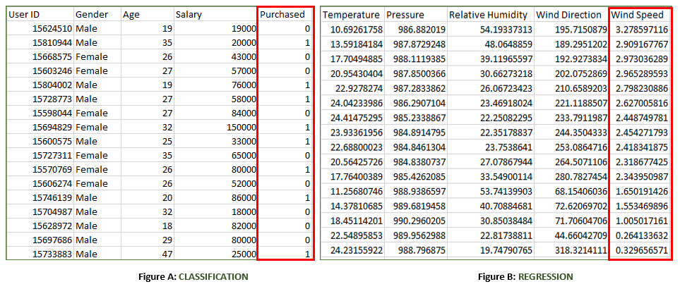

# Supervised learning - Classification and Regression

## Supervised Learning

Supervised learning is a machine learning paradigm for problems where the available data consists of labeled examples, meaning that each data point contains features (covariates) and an associated label. The goal of supervised learning algorithms is learning a function that maps feature vectors (inputs) to labels (output), based on example input-output pairs.

In this type of learning both training and validation, datasets are labelled as shown in the figures below. 

- **Figure A:** It is a dataset of a shopping store that is useful in predicting whether a customer will purchase a particular product under consideration or not based on his/ her gender, age, and salary. 
    
    **Input:** Gender, Age, Salary 
    
    **Output:** Purchased i.e. 0 or 1; 1 means yes the customer will purchase and 0 means that the customer won’t purchase it. 
- **Figure B:** It is a Meteorological dataset that serves the purpose of predicting wind speed based on different parameters. 

    **Input:** Dew Point, Temperature, Pressure, Relative Humidity, Wind Direction 
    **Output:** Wind Speed 

## Training the system: 
While training the model, data is usually split in the ratio of 80:20 i.e. 80% as training data and the rest as testing data. In training data, we feed input as well as output for 80% of data. The model learns from training data only. We use different machine learning algorithms(which we will discuss in detail in the next articles) to build our model. Learning means that the model will build some logic of its own. 
Once the model is ready then it is good to be tested. At the time of testing, the input is fed from the remaining 20% of data that the model has never seen before, the model will predict some value and we will compare it with the actual output and calculate the accuracy. 

## Types of Supervised Learning:  
Supervised learning is a machine learning technique that is widely used in various fields such as finance, healthcare, marketing, and more. It is a form of machine learning in which the algorithm is trained on labeled data to make predictions or decisions based on the data inputs.

In supervised learning, the algorithm learns a mapping between the input and output data. This mapping is learned from a labeled dataset, which consists of pairs of input and output data. The algorithm tries to learn the relationship between the input and output data so that it can make accurate predictions on new, unseen data.

The labeled dataset used in supervised learning consists of input features and corresponding output labels. The input features are the attributes or characteristics of the data that are used to make predictions, while the output labels are the desired outcomes or targets that the algorithm tries to predict.

Supervised learning is typically divided into two main categories: regression and classification. In regression, the algorithm learns to predict a continuous output value, such as the price of a house or the temperature of a city. In classification, the algorithm learns to predict a categorical output variable or class label, such as whether a customer is likely to purchase a product or not.

One of the primary advantages of supervised learning is that it allows for the creation of complex models that can make accurate predictions on new data. However, supervised learning requires large amounts of labeled training data to be effective. Additionally, the quality and representativeness of the training data can have a significant impact on the accuracy of the model.

## Supervised learning can be further classified into two categories:

**Regression:** In regression, the target variable is a continuous value. The goal of regression is to predict the value of the target variable based on the input variables. Linear regression, polynomial regression, and decision trees are some of the examples of regression algorithms.

**Classification:** In classification, the target variable is a categorical value. The goal of classification is to predict the class or category of the target variable based on the input variables. Some examples of classification algorithms include logistic regression, decision trees, support vector machines, and neural networks.

## **Supervised Learning Algorithms:**
- K Nearest Neighbor (KNN)
- Naive Bayes
- Decision Trees
- Linear Regression
- Logistic Regression
- Support Vector Machines (SVM)
- Neural Networks

## Brief explanation:

- **Linear Regression**
Linear regression is a type of regression algorithm that is used to predict a continuous output value. It is one of the simplest and most widely used algorithms in supervised learning. In linear regression, the algorithm tries to find a linear relationship between the input features and the output value. The output value is predicted based on the weighted sum of the input features.

- **Logistic Regression**
Logistic regression is a type of classification algorithm that is used to predict a binary output variable. It is commonly used in machine learning applications where the output variable is either true or false, such as in fraud detection or spam filtering. In logistic regression, the algorithm tries to find a linear relationship between the input features and the output variable. The output variable is then transformed using a logistic function to produce a probability value between 0 and 1.

- **Decision Trees**
A decision tree is a type of algorithm that is used for both classification and regression tasks. It is a tree-like structure that is used to model decisions and their possible consequences. Each internal node in the tree represents a decision, while each leaf node represents a possible outcome. Decision trees can be used to model complex relationships between input features and output variables.

- **Random Forests**
Random forests are an ensemble learning technique that is used for both classification and regression tasks. They are made up of multiple decision trees that work together to make predictions. Each tree in the forest is trained on a different subset of the input features and data. The final prediction is made by aggregating the predictions of all the trees in the forest

    - hine (SVM)
    - Random Forest
