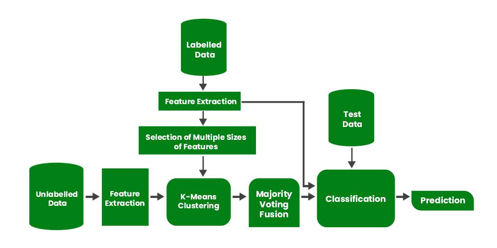

# Semi-Supervised Learning

Semi-supervised learning is a type of machine learning that falls in between supervised and unsupervised learning. It is a method that uses a small amount of labeled data and a large amount of unlabeled data to train a model. The goal of semi-supervised learning is to learn a function that can accurately predict the output variable based on the input variables, similar to supervised learning. However, unlike supervised learning, the algorithm is trained on a dataset that contains both labeled and unlabeled data.

Semi-supervised learning is particularly useful when there is a large amount of unlabeled data available, but it’s too expensive or difficult to label all of it. 

Intuitively, one may imagine the three types of learning algorithms as Supervised learning where a student is under the supervision of a teacher at both home and school, Unsupervised learning where a student has to figure out a concept himself and Semi-Supervised learning where a teacher teaches a few concepts in class and gives questions as homework which are based on similar concepts. 

## Examples of Semi-Supervised Learning:

- **Text classification:** In text classification, the goal is to classify a given text into one or more predefined categories. Semi-supervised learning can be used to train a text classification model using a small amount of labeled data and a large amount of unlabeled text data.
- **Image classification:** In image classification, the goal is to classify a given image into one or more predefined categories. Semi-supervised learning can be used to train an image classification model using a small amount of labeled data and a large amount of unlabeled image data.
- **Anomaly detection:** In anomaly detection, the goal is to detect patterns or observations that are unusual or different from the norm

## Assumptions followed by Semi-Supervised Learning:
A Semi-Supervised algorithm assumes the following about the data

- **Continuity Assumption:** The algorithm assumes that the points which are closer to each other are more likely to have the same output label.
- **Cluster Assumption:** The data can be divided into discrete clusters and points in the same cluster are more likely to share an output label.
- **Manifold Assumption:** The data lie approximately on a manifold of a much lower dimension than the input space. This assumption allows the use of distances and densities which are defined on a manifold.

## Applications of Semi-Supervised Learning:

- **Speech Analysis:** Since labeling audio files is a very intensive task, Semi-Supervised learning is a very natural approach to solve this problem.

- **Internet Content Classification:** Labeling each webpage is an impractical and unfeasible process and thus uses Semi-Supervised learning algorithms. Even the Google search algorithm uses a variant of Semi-Supervised learning to rank the relevance of a webpage for a given query.

- **Protein Sequence Classification:** Since DNA strands are typically very large in size, the rise of Semi-Supervised learning has been imminent in this field.

## Disadvantages of Semi-Supervised Learning
The most basic disadvantage of any Supervised Learning algorithm is that the dataset has to be hand-labeled either by a Machine Learning Engineer or a Data Scientist. This is a very costly process, especially when dealing with large volumes of data. The most basic disadvantage of any Unsupervised Learning is that its application spectrum is limited. 

To counter these disadvantages, the concept of Semi-Supervised Learning was introduced. In this type of learning, the algorithm is trained upon a combination of labeled and unlabelled data. Typically, this combination will contain a very small amount of labeled data and a very large amount of unlabelled data. The basic procedure involved is that first, the programmer will cluster similar data using an unsupervised learning algorithm and then use the existing labeled data to label the rest of the unlabelled data. The typical use cases of such type of algorithm have a common property among them – The acquisition of unlabelled data is relatively cheap while labeling the said data is very expensive. 
